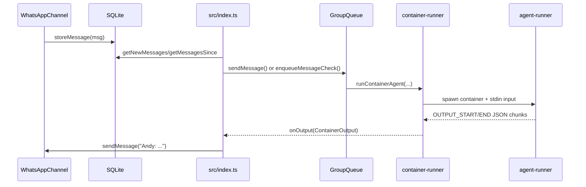
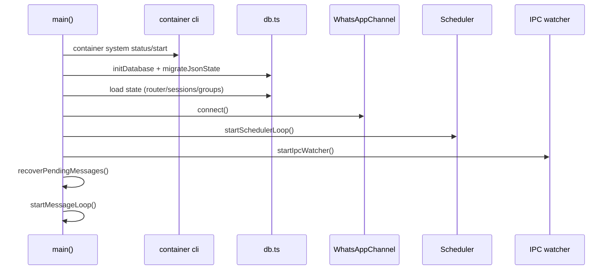
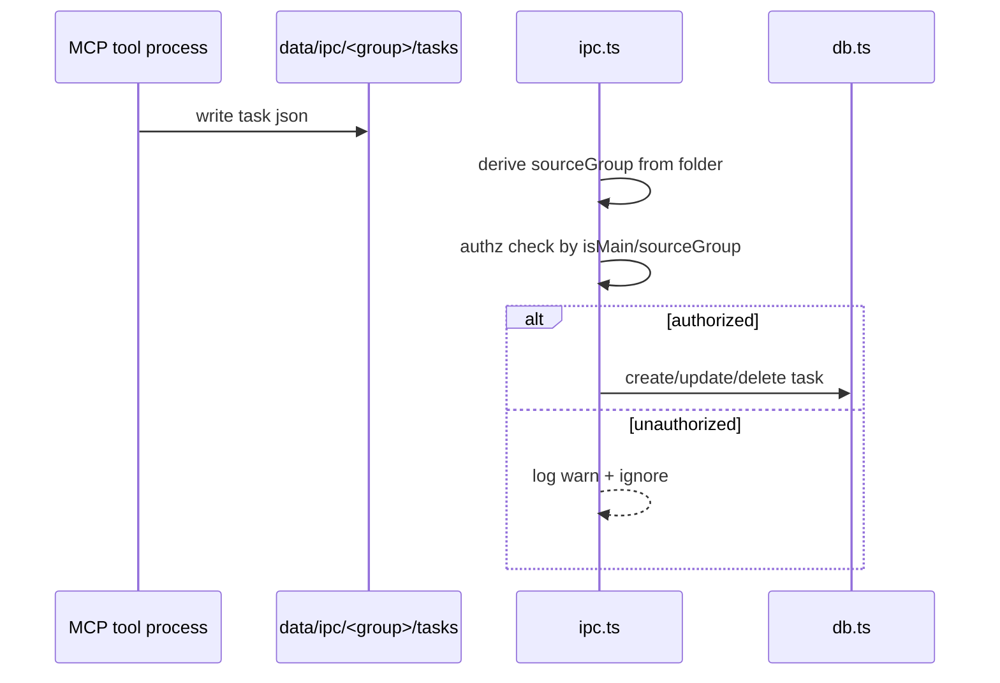
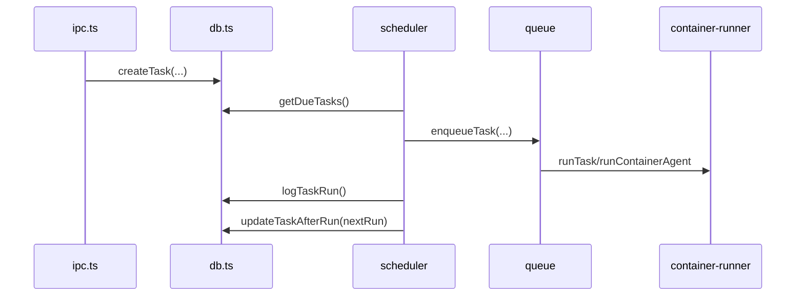

# 0) Repo Fingerprint

- **Commit**: `8eb80d4` (`git rev-parse --short HEAD`, `git describe --always --tags --dirty`).
- **Package name/version**: `nanoclaw@1.0.0` (`package.json`). (package.json:2-3)
- **Languages/runtime**: TypeScript/Node.js ESM (`"type": "module"`), Node `>=20`. (package.json:5,40-42)
- **Build system**:
  - `npm run build` → `tsc`
  - `npm run start` → `node dist/index.js`
  - `npm run dev` → `tsx src/index.ts`
  - `npm test` → `vitest run`
  (package.json:7-16)
- **Monorepo layout**: Not a monorepo; single runtime under `src/` plus container-side runtime under `container/agent-runner/src/`. (README.md:124-135), (src/index.ts:456-512), (container/agent-runner/src/index.ts:447-533)

---

# 1) Final Architecture Diagram (One Page)

```mermaid
flowchart TD
  WA[WhatsApp via Baileys\nsrc/channels/whatsapp.ts]
  DB[(SQLite store/messages.db\nsrc/db.ts)]
  Host[Host Orchestrator\nsrc/index.ts]
  Queue[Per-group queue\nsrc/group-queue.ts]
  Sched[Scheduler loop\nsrc/task-scheduler.ts]
  IPC[IPC watcher\nsrc/ipc.ts]
  Cont[Apple container process\nsrc/container-runner.ts]
  Runner[Container agent runner\ncontainer/agent-runner/src/index.ts]
  MCP[MCP stdio tools\ncontainer/agent-runner/src/ipc-mcp-stdio.ts]
  FS[/data/ipc + data/sessions + groups/]

  WA -->|on inbound| DB
  Host -->|poll getNewMessages|get DB
  Host --> Queue
  Sched --> Queue
  Queue --> Cont
  Cont --> Runner
  Runner --> MCP
  MCP -->|atomic json files| FS
  IPC -->|poll files| FS
  IPC --> DB
  IPC --> WA
  Host -->|state/tasks/sessions| DB
  Cont -->|streamed output markers| Host
```

**Confirmed** by code: host boot, scheduler, IPC watcher, queue, container spawning, and MCP IPC filesystem bridge. (src/index.ts:483-503), (src/group-queue.ts:56-113), (src/container-runner.ts:229-285), (container/agent-runner/src/index.ts:374-411), (container/agent-runner/src/ipc-mcp-stdio.ts:23-35), (src/ipc.ts:44-131)

---

# 2) Component Index (Repo → Runtime mapping)

| Module | Responsibility | Runtime | Entrypoints | Key dependencies |
|---|---|---|---|---|
| `src/index.ts` | Main orchestrator: boot, polling loop, recovery, wiring | server/orchestrator | `main()`, `startMessageLoop()` | `GroupQueue`, DB, WhatsAppChannel, IPC, scheduler |
| `src/channels/whatsapp.ts` | WhatsApp transport, auth, reconnect, queueing | channel adapter | `connect()`, `sendMessage()`, `syncGroupMetadata()` | `@whiskeysockets/baileys` |
| `src/group-queue.ts` | Per-group serialization + global concurrency cap + retries | queue/worker coordinator | `enqueueMessageCheck`, `enqueueTask`, `registerProcess` | `MAX_CONCURRENT_CONTAINERS` |
| `src/container-runner.ts` | Container process spawn, mount policy application, timeout/stream parsing | process runtime | `runContainerAgent()` | `child_process`, mount-security |
| `src/ipc.ts` | Host-side IPC file polling + authz for task/message actions | IPC gateway | `startIpcWatcher()`, `processTaskIpc()` | `cron-parser`, DB |
| `src/task-scheduler.ts` | Due-task polling and execution dispatch | scheduler worker | `startSchedulerLoop()` | DB, queue, container-runner |
| `src/db.ts` | SQLite schema and persistence API | persistence | `initDatabase()` + CRUD funcs | `better-sqlite3` |
| `src/mount-security.ts` | Additional mount allowlist enforcement | security lib | `validateMount()`, `validateAdditionalMounts()` | external allowlist file |
| `container/agent-runner/src/index.ts` | In-container query loop with streaming and IPC input multiplexing | container worker | `main()`, `runQuery()` | `@anthropic-ai/claude-agent-sdk` |
| `container/agent-runner/src/ipc-mcp-stdio.ts` | MCP tool server writing IPC messages/tasks files | MCP server | `server.tool(...)`, stdio transport | `@modelcontextprotocol/sdk`, `zod` |

Evidence: (README.md:126-135), (src/index.ts:456-503), (src/group-queue.ts:27-33), (src/container-runner.ts:229-243), (src/ipc.ts:34-44), (src/task-scheduler.ts:182-218), (src/db.ts:87-96), (src/mount-security.ts:335-384), (container/agent-runner/src/index.ts:447-533), (container/agent-runner/src/ipc-mcp-stdio.ts:37-40,277-279)

---

# 3) Verified Entrypoints (Boot “spine”)

## Host runtime spine

1. **`src/index.ts`**
   - `main()` initializes container subsystem, DB, state, WhatsApp, scheduler, IPC, queue, and message loop. (src/index.ts:456-504)
   - Direct-run guard executes `main().catch(...)`. (src/index.ts:507-515)

2. **`src/channels/whatsapp.ts`**
   - `connectInternal` wires connection lifecycle, QR handling, reconnect, message ingestion. (src/channels/whatsapp.ts:52-183)

3. **`src/task-scheduler.ts`**
   - `startSchedulerLoop` polls due tasks and enqueues executions. (src/task-scheduler.ts:182-218)

4. **`src/ipc.ts`**
   - `startIpcWatcher` scans group IPC dirs and dispatches message/task commands. (src/ipc.ts:34-156)

## Container runtime spine

1. **`container/agent-runner/src/index.ts`**
   - `main()` parses stdin container input and runs query loop with IPC follow-ups. (container/agent-runner/src/index.ts:447-519)

2. **`container/agent-runner/src/ipc-mcp-stdio.ts`**
   - Starts MCP stdio server and exposes tools (`send_message`, `schedule_task`, etc.). (container/agent-runner/src/ipc-mcp-stdio.ts:42-279)

---

# 4) Golden Paths (4 required)

## A) Primary inbound message → agent response

### Narrative
1. WhatsApp upsert events are parsed; only registered-group full messages are persisted. (src/channels/whatsapp.ts:144-181)
2. Host polling loop gets new messages from SQLite and groups by chat. (src/index.ts:300-325), (src/db.ts:234-259)
3. Trigger policy applies for non-main groups; pending context gathered via `getMessagesSince`. (src/index.ts:331-353), (src/db.ts:262-277)
4. Queue either pipes to active container via IPC input files or enqueues a new run. (src/index.ts:355-366), (src/group-queue.ts:126-141)
5. `processGroupMessages` formats prompt, advances cursor (with rollback on error), and runs container agent. (src/index.ts:120-210)
6. Streamed container results are forwarded to WhatsApp with assistant prefix. (src/index.ts:172-185)

### Sequence


### Side effects
- DB writes: messages/router_state/sessions. (src/db.ts:195-206,421-439)
- Filesystem IPC writes for active container piping. (src/group-queue.ts:130-138)
- Network send through WhatsApp API. (src/channels/whatsapp.ts:193-199)

### Error/retry/timeout evidence
- Cursor rollback on error if no user-visible output sent. (src/index.ts:195-207)
- Group retry backoff exponential up to 5 retries. (src/group-queue.ts:220-241)
- Container hard timeout with graceful stop attempt then SIGKILL fallback. (src/container-runner.ts:373-381,384-390)

---

## B) Startup boot flow

### Narrative
1. `main()` ensures container runtime availability and cleans orphan `nanoclaw-*` containers. (src/index.ts:394-453)
2. Initializes SQLite and runs JSON migration. (src/index.ts:458-460), (src/db.ts:87-96,533-584)
3. Loads router/session/group state from DB. (src/index.ts:54-69)
4. Connects WhatsApp; then starts scheduler, IPC watcher, queue callback, recovery, and polling loop. (src/index.ts:472-503)

### Sequence


### Side effects
- External process exec (`container system status/start`, `container ls/stop`). (src/index.ts:396-446)
- DB schema creation/migrations. (src/db.ts:10-85,533-584)

### Error handling
- Fatal throw if container system cannot start. (src/index.ts:403-430)
- Loop-level catches in scheduler/message loop/IPC watcher with continued polling. (src/index.ts:369-373), (src/task-scheduler.ts:210-215), (src/ipc.ts:52-56,146-151)

---

## C) AuthZ path for IPC task/message actions

### Narrative
1. Host identifies caller by IPC directory (`sourceGroup`), not by payload claims. (src/ipc.ts:45-63,176-179)
2. `message` commands: main can send anywhere; non-main only to own mapped chat. (src/ipc.ts:76-94)
3. `schedule_task`: target must be registered; non-main cannot target other folders. (src/ipc.ts:190-211)
4. Task lifecycle ops (`pause/resume/cancel`) enforce same rule (`isMain || task.group_folder===sourceGroup`). (src/ipc.ts:275-327)
5. `refresh_groups` and `register_group` are main-only. (src/ipc.ts:329-376)

### Sequence


### Side effects
- IPC files consumed/deleted or moved to error directory. (src/ipc.ts:97-108,131,137-142)
- Task records written to SQLite. (src/ipc.ts:256-267), (src/db.ts:279-299)

### Error semantics
- Invalid schedule input logged and request dropped. (src/ipc.ts:223-247)
- Unknown type logged without crash. (src/ipc.ts:378-380)

---

## D) Persistence path (tasks + sessions + migration)

### Narrative
1. DB schema creates source-of-truth tables (`messages`, `scheduled_tasks`, `task_run_logs`, `sessions`, `registered_groups`, `router_state`). (src/db.ts:10-75)
2. Scheduled task creation writes row with schedule metadata and `context_mode`. (src/db.ts:279-299)
3. Scheduler pulls due active tasks and enqueues execution. (src/task-scheduler.ts:192-209), (src/db.ts:368-379)
4. Task run writes run log and updates `next_run` or marks completed when `nextRun` null. (src/task-scheduler.ts:151-177), (src/db.ts:381-394)
5. Legacy JSON state files are imported once and renamed `.migrated`. (src/db.ts:533-540,546-583)

### Sequence


### Side effects
- SQLite writes and reads throughout task lifecycle. (src/db.ts:279-409)
- Per-group logs written under `groups/<folder>/logs`. (src/container-runner.ts:268-269,440-495)

### Error/retry/timeouts
- Scheduler catches run errors and records error status. (src/task-scheduler.ts:143-158)
- Container timeout surfaced as error only when no streamed output. (src/container-runner.ts:409-437)

---

# 5) Concurrency & Queue Semantics

- **Model**: one `GroupQueue` per host process, with per-group state and global `activeCount`. (src/group-queue.ts:27-33)
- **Serialization guarantee (Confirmed)**: each group has single `active` flag; tasks/messages for same group queue behind active run. (src/group-queue.ts:61-65,93-97,165-167,197-200)
- **Global concurrency default**: `MAX_CONCURRENT_CONTAINERS` env/default 5; minimum 1. (src/config.ts:38-41)
- **Backpressure**: over-limit groups pushed to `waitingGroups`; drained when slots open. (src/group-queue.ts:67-76,99-109,265-279)
- **Priority**: queued tasks run before pending messages in `drainGroup`/`drainWaiting`. (src/group-queue.ts:248-259,273-279)
- **Retries**: message processing retries with exponential backoff `5s * 2^(retry-1)` up to 5 attempts. (src/group-queue.ts:14-16,220-241)
- **Timeouts/cancellation**:
  - Container hard timeout from config with idle grace floor. (src/container-runner.ts:368-372)
  - On timeout, graceful `container stop` then force kill fallback. (src/container-runner.ts:373-381)
  - Idle cancellation path writes `_close` sentinel. (src/group-queue.ts:147-155), (container/agent-runner/src/index.ts:263-269)

---

# 6) State & Data Model (Truth tables)

| Artifact | Type | Source-of-truth? | Location | Notes |
|---|---|---|---|---|
| Messages | persisted rows | Yes | `messages` table | Primary inbound history store. |
| Chats metadata | persisted rows | Yes | `chats` table | Group discovery + names/timestamps. |
| Scheduled tasks | persisted rows | Yes | `scheduled_tasks` | Active/paused/completed state. |
| Task run history | append log table | Yes | `task_run_logs` | Per-run result/error/duration. |
| Router cursors | key/value table | Yes | `router_state` | `last_timestamp`, `last_agent_timestamp`. |
| Session IDs | persisted rows | Yes | `sessions` table | Maps group folder→Claude session ID. |
| Registered groups | persisted rows | Yes | `registered_groups` | Includes `container_config` JSON blob. |
| IPC task snapshot | derived cache | No | `data/ipc/<group>/current_tasks.json` | Rewritten from DB task list. |
| IPC available groups snapshot | derived cache | No | `data/ipc/<group>/available_groups.json` | For container-side tools. |
| Container logs | derived operational logs | No | `groups/<folder>/logs/container-*.log` | Debug/forensics only. |
| Legacy JSON files | migration input | Transitional | `data/*.json` | Renamed to `.migrated` once imported. |

Evidence: (src/db.ts:10-75), (src/db.ts:279-299), (src/db.ts:396-409), (src/db.ts:414-425), (src/db.ts:427-451), (src/db.ts:453-529), (src/container-runner.ts:595-619,633-657), (src/container-runner.ts:440-495), (src/db.ts:533-540)

**Retention/compaction/forgetting**:
- Task run logs are retained until task deletion (`deleteTask` removes child logs). (src/db.ts:362-365)
- No automatic pruning/TTL for message history or task logs found in code. **Not verified** for any external retention policy.
  - Searched: `retention|ttl|prune|vacuum|cleanup` in `src`, `docs`.
  - Checked files: `src/db.ts`, `src/task-scheduler.ts`, `docs/SPEC.md`, `docs/SECURITY.md`.
  - Would confirm: explicit cleanup job or SQL DELETE policy.

---

# 7) Tooling, Sandbox, and Safety

**Applicable (repo executes tools and untrusted input).**

- **Approval gates / permission mode**: container agent explicitly sets `permissionMode: 'bypassPermissions'` and `allowDangerouslySkipPermissions: true`. (container/agent-runner/src/index.ts:393-395)
- **Allow/deny rules for filesystem mounts**:
  - External allowlist file path outside project. (src/config.ts:11-17)
  - Block patterns include secrets/credentials paths. (src/mount-security.ts:28-46)
  - Symlink resolution + allowed-root check + container path traversal guard. (src/mount-security.ts:138-143,175-193,201-218,280-289)
- **Process execution model**:
  - Host spawns `container run -i --rm ...`; tracks stdout/stderr with truncation limits. (src/container-runner.ts:209-227,271-307,344-363)
  - Timeout stop model documented in code path. (src/container-runner.ts:373-390)
- **Browser automation stack**:
  - **Inference**: host advertises browser capability via docs and container assets, but runtime enforcement path for browser tool invocation is in Claude SDK internals, not this repo.
  - Evidence in repo: docs mention `agent-browser + Chromium`. (docs/SPEC.md:80), (docs/REQUIREMENTS.md:157-158)
  - What would confirm fully: concrete agent-browser binary wiring in container image runtime startup scripts.

---

# 8) Plugin System & Supply Chain Risk

- **Repository plugin system (host)**: No first-class dynamic plugin loader in `src/` (no `loadPlugin`/dynamic module discovery patterns found in runtime code). **Confirmed by search + import graph review.**
- **Extensibility mechanism actually used**:
  1. Claude skills copied from `container/skills/*` into each group session directory. (src/container-runner.ts:126-141)
  2. MCP tools exposed by local stdio server (`ipc-mcp-stdio`). (container/agent-runner/src/index.ts:396-405), (container/agent-runner/src/ipc-mcp-stdio.ts:42-275)
  3. SDK hooks used (`PreCompact`). (container/agent-runner/src/index.ts:407-409)
- **Compatibility checks**:
  - MCP server declares version `1.0.0`, but no explicit protocol-version negotiation/compat checks were found in host code. (container/agent-runner/src/ipc-mcp-stdio.ts:37-40)
- **Risk analysis (evidenced)**:
  - Malicious skill content copied automatically into runtime `.claude/skills` for each group. (src/container-runner.ts:126-141)
  - Agent process has broad tool access and bypass permissions. (container/agent-runner/src/index.ts:383-395)
  - Mitigation: filesystem blast radius constrained by explicit mount model + allowlist for extra mounts. (src/container-runner.ts:58-99,196-204), (src/mount-security.ts:335-384)

---

# 9) Reconciliation Matrix (Docs vs Code vs Third-party)

> Third-party links were discovered, but fetching external pages returned HTTP 403 in this environment; third-party evidence is therefore mostly **Not verified**.

| # | Claim | Code evidence | Docs evidence | Third-party evidence | Status |
|---|---|---|---|---|---|
| 1 | Single host Node process orchestrates system | (src/index.ts:456-503) | "Single Node.js process." (README.md:124-124) | Not verified (403 fetching links) | Confirmed |
| 2 | WhatsApp is current channel implementation | (src/channels/whatsapp.ts:29-31) | "WhatsApp I/O" (README.md:49-49) | Not verified | Confirmed |
| 3 | SQLite is persistence backend | (src/db.ts:1-2,87-92) | "SQLite" (README.md:121-121) | Not verified | Confirmed |
| 4 | Polling loop processes messages | (src/index.ts:300-373) | "Message Loop (polls SQLite)" (docs/SPEC.md:40-41) | Not verified | Confirmed |
| 5 | Scheduler checks due tasks every minute | (src/config.ts:5), (src/task-scheduler.ts:214-215) | "checks for due tasks every minute" (docs/REQUIREMENTS.md:150-150) | Not verified | Confirmed |
| 6 | Queue has global concurrency limit | (src/group-queue.ts:67-76,267-269) | "concurrency control" (README.md:124-124) | Not verified | Confirmed |
| 7 | Default max concurrent containers is 5 | (src/config.ts:38-41) | "... || '5'" excerpt in config section (docs/SPEC.md:194-194) | Not verified | Confirmed |
| 8 | Non-main groups require trigger by default | (src/index.ts:332-342), (src/db.ts:73-74,499-500) | "Trigger word required" (docs/SPEC.md:574-574) | Not verified | Confirmed |
| 9 | Main group bypasses trigger requirement | (src/index.ts:331-333) | Main channel admin semantics (README.md:51-52) | Not verified | Confirmed |
|10| IPC is filesystem based | (src/ipc.ts:41-43,62-64), (src/group-queue.ts:130-137) | "IPC via filesystem" (README.md:124-124) | Not verified | Confirmed |
|11| IPC message send is authorized by source group | (src/ipc.ts:76-94) | IPC auth matrix (docs/SECURITY.md:52-61) | Not verified | Confirmed |
|12| Non-main cannot schedule tasks for other groups | (src/ipc.ts:204-211) | IPC auth matrix (docs/SECURITY.md:58-60) | Not verified | Confirmed |
|13| Additional mounts validated by external allowlist | (src/mount-security.ts:53-71,280-289) | External allowlist section (docs/SECURITY.md:26-30) | Not verified | Confirmed |
|14| Sensitive path patterns blocked in mount validation | (src/mount-security.ts:28-46,268-277) | Blocked patterns listed (docs/SECURITY.md:31-36) | Not verified | Confirmed |
|15| Only selected auth vars from `.env` mounted to container | (src/container-runner.ts:167-183) | Credential filtering docs (docs/SECURITY.md:74-77) | Not verified | Confirmed |
|16| Container timeout defaults to 30 minutes | (src/config.ts:25-28) | Config docs `1800000` (docs/SPEC.md:191-191) | Not verified | Confirmed |
|17| Idle timeout also defaults 30 minutes | (src/config.ts:34-37) | Config docs `1800000` (docs/SPEC.md:193-193) | Not verified | Confirmed |
|18| Retry behavior exists with exponential backoff | (src/group-queue.ts:220-241) | Debug doc mentions retries (docs/DEBUG_CHECKLIST.md:74-74) | Not verified | Confirmed |
|19| Agents can use MCP nanoclaw tools from container | (container/agent-runner/src/index.ts:391-405), (container/agent-runner/src/ipc-mcp-stdio.ts:42-275) | MCP tools table (docs/SPEC.md:470-476) | Not verified | Confirmed |
|20| Session IDs persisted and resumed per group | (src/index.ts:219-223,249-253), (src/db.ts:429-451) | Session management notes (docs/SPEC.md:306-306) | Not verified | Confirmed |
|21| Claim: "No message queues" in philosophy | Queue exists in code (src/group-queue.ts:27-33) | "No message queues" (README.md:33-33) | Not verified | Contradicted |
|22| Claim: "One process" | Host+container runner+MCP subprocesses exist (src/container-runner.ts:271-274), (container/agent-runner/src/index.ts:374-411) | "One process" wording (README.md:19-19,33-33) | Not verified | Partially confirmed |

---

# 10) Actionable Feedback (Engineering + Security)

1. **Tighten permission mode in container runner**
   - Why: explicit `bypassPermissions` + dangerous skip elevates blast radius.
   - Change: `container/agent-runner/src/index.ts` options block.
   - Impact: stronger runtime guardrails.
   - Effort/Risk: M/M.

2. **Add explicit retention policy for `messages` and `task_run_logs`**
   - Why: unbounded growth + privacy risk.
   - Change: `src/db.ts`, new scheduler cleanup in `src/task-scheduler.ts`.
   - Impact: predictable storage/privacy.
   - Effort/Risk: M/M.

3. **Add per-group fair scheduling (avoid waiting-group starvation)**
   - Why: `waitingGroups` array + task-priority may starve message-heavy groups.
   - Change: `src/group-queue.ts` round-robin + aging.
   - Impact: fairness/latency stability.
   - Effort/Risk: M/M.

4. **Persist queue retry metadata for crash continuity**
   - Why: retries reset after process restart.
   - Change: `src/group-queue.ts` + optional DB table in `src/db.ts`.
   - Impact: resilience during host restarts.
   - Effort/Risk: M/L.

5. **Validate and normalize `folder` when registering groups**
   - Why: `register_group` accepts arbitrary folder strings.
   - Change: `src/ipc.ts` `register_group` case.
   - Impact: path hygiene and fewer mount/path errors.
   - Effort/Risk: S/L.

6. **Harden IPC file schema validation on host side**
   - Why: host `JSON.parse` then ad-hoc key checks; malformed payloads only partly constrained.
   - Change: `src/ipc.ts` with Zod schema per message type.
   - Impact: safer command parsing.
   - Effort/Risk: S/L.

7. **Add audit logging for rejected mount requests with stable IDs**
   - Why: forensic traceability for repeated abuse attempts.
   - Change: `src/mount-security.ts` logging format.
   - Impact: better incident response.
   - Effort/Risk: S/L.

8. **Enforce max IPC file consumption per poll cycle**
   - Why: burst of files could monopolize event loop.
   - Change: `src/ipc.ts` loops over `messageFiles`/`taskFiles`.
   - Impact: smoother latency under load.
   - Effort/Risk: S/M.

9. **Document and test contradiction in README (“no message queues”)**
   - Why: architecture drift undermines trust.
   - Change: `README.md` architecture/philosophy section.
   - Impact: accurate operational expectations.
   - Effort/Risk: S/L.

10. **Add protocol version assertion between host and container runner markers**
   - Why: marker/protocol drift can silently break parsing.
   - Change: `src/container-runner.ts` + `container/agent-runner/src/index.ts`.
   - Impact: safer upgrades.
   - Effort/Risk: M/M.

---

# 11) Open Questions (if any)

1. **Is there intended long-term retention/cleanup policy for messages and task logs?**
   - Not answered in code.
   - Inspect next: operational docs or launchd cron maintenance scripts.

2. **Should non-main groups ever see `available_groups.json` metadata subset?**
   - Current code returns empty list for non-main.
   - Inspect next: product intent in requirements and user UX expectations.

3. **Is `permissionMode: bypassPermissions` a permanent security posture or temporary workaround?**
   - Code hard-codes it.
   - Inspect next: maintainer docs/issues for threat model decision.

---


---

# 12) Pros/Cons vs Original OpenClaw Architecture (Comparison)

> Scope note: OpenClaw code was **not accessible from this environment** (HTTP 403 on linked sources). Comparison below is based on the user-provided OpenClaw architecture summary and this repository's verified code.

## Pros of NanoClaw architecture (relative to reported OpenClaw design)

1. **Smaller host runtime blast radius**
   - NanoClaw uses a compact host orchestrator + SQLite + file IPC pipeline. (src/index.ts:456-503), (src/db.ts:87-96), (src/ipc.ts:34-44)
   - The codebase explicitly centralizes control in one host process loop model. (README.md:124-135)

2. **OS-level isolation-first execution model**
   - Agent work is executed in containers with explicit mount lists. (src/container-runner.ts:58-99,209-227)
   - Additional mounts are validated through an external allowlist with blocked patterns and path checks. (src/mount-security.ts:53-71,201-218,268-289)

3. **Per-group isolation semantics are straightforward**
   - Group sessions, IPC namespaces, and per-group folders are isolated by folder boundaries. (src/container-runner.ts:100-158)
   - IPC authorization is enforced by source folder identity (`sourceGroup`) rather than trusting payload claims. (src/ipc.ts:45-63,176-179)

4. **Operational behavior is easier to reason about**
   - Queueing, retries, and timeouts are implemented in a small number of files with explicit constants. (src/group-queue.ts:14-16,220-241), (src/container-runner.ts:368-390)

## Cons of NanoClaw architecture (relative to reported OpenClaw design)

1. **Less protocol/service richness out-of-the-box**
   - NanoClaw implements WhatsApp-centric channeling and does not expose a broad first-class HTTP/WS API surface comparable to the OpenClaw summary.
   - Verified local evidence shows a WhatsApp-first runtime with local IPC for tool actions. (src/channels/whatsapp.ts:29-31,144-181), (src/ipc.ts:65-131)

2. **Simpler memory subsystem**
   - NanoClaw persists chat/task/session state in SQLite but does not implement built-in FTS/vector hybrid memory search in the host runtime.
   - DB schema and query paths are conventional tables/indices without FTS5/vector constructs. (src/db.ts:10-75,234-277)

3. **Limited extensibility model at host layer**
   - Host runtime does not show a formal plugin registry/loader architecture in `src/`.
   - Extensibility is primarily via container-side skills + MCP tools. (src/container-runner.ts:126-141), (container/agent-runner/src/ipc-mcp-stdio.ts:42-275)

4. **Security posture has strong isolation, but permissive agent tool permissions**
   - The container agent enables `permissionMode: 'bypassPermissions'` and dangerous skip flags. (container/agent-runner/src/index.ts:393-395)
   - This can undercut safety controls if mounts are overly permissive.

## Net assessment

- **NanoClaw strengths**: minimal architecture, clear isolation boundaries, easier auditability.
- **NanoClaw tradeoff**: fewer built-in gateways/protocols/memory features and less structured plugin/runtime modularity than the reported OpenClaw architecture.
- **Not verified warning**: OpenClaw-specific details here are comparative context from the provided external summary, not independently source-verified in this environment.

# Appendix — Exact Commands Run

```bash
git rev-parse --short HEAD
git describe --always --tags --dirty

rg -n --hidden --no-ignore-vcs "main\(|__main__|if __name__|createServer|listen\(|app\.listen|http\.createServer|new Server\(|serve\(|run\(|start\(|bin/|cmd/|cli" .
rg -n --hidden --no-ignore-vcs "dotenv|process\.env|ENV\[|os\.environ|config|Config|settings|schema|zod|pydantic|viper|koanf|yaml|toml|json5" .

rg -n --hidden --no-ignore-vcs "main\(|__main__|if __name__|createServer|listen\(|app\.listen|http\.createServer|new Server\(|serve\(|run\(|start\(|bin/|cmd/|cli" README.md docs src container/agent-runner/src package.json
rg -n --hidden --no-ignore-vcs "dotenv|process\.env|ENV\[|os\.environ|config|Config|settings|schema|zod|pydantic|viper|koanf|yaml|toml|json5" README.md docs src container/agent-runner/src package.json
rg -n --hidden --no-ignore-vcs "auth|jwt|session|csrf|cors|rbac|acl|scope|role|permission|nonce|token|refresh|apikey|api key|signature|hmac" README.md docs src container/agent-runner/src package.json
rg -n --hidden --no-ignore-vcs "sqlite|fts5|bm25|postgres|mysql|mongodb|redis|rocksdb|leveldb|s3|filesystem|jsonl|parquet|arrow|migration|migrate|prisma|drizzle|typeorm|sequelize|alembic" README.md docs src container/agent-runner/src package.json
rg -n --hidden --no-ignore-vcs "queue|worker|pool|concurrency|semaphore|mutex|channel|job|task|bullmq|bull|celery|rq|sidekiq|cron|scheduler|rate limit|backpressure|retry|timeout|AbortController|cancel" README.md docs src container/agent-runner/src package.json
rg -n --hidden --no-ignore-vcs "plugin|extension|register|hook|middleware|manifest|dynamic import|import\(|require\(|jiti|loadPlugin|load_plugins|entryPoints" README.md docs src container/agent-runner/src package.json
rg -n --hidden --no-ignore-vcs "/v1|router|express|fastify|koa|hono|websocket|ws|socket\.io|grpc|openapi|swagger|graphql|sse|eventstream|pairing|hello-ok|protocol|PROTOCOL_VERSION" README.md docs src container/agent-runner/src package.json
rg -n --hidden --no-ignore-vcs "playwright|puppeteer|cdp|chrome devtools|aria|snapshot|screenshot|spawn\(|exec\(|execFile\(|child_process|subprocess|pty|shell" README.md docs src container/agent-runner/src package.json container/Dockerfile

npx madge --circular --extensions ts,tsx,js,jsx src

npm test
npm run typecheck

curl -L -s https://raw.githubusercontent.com/openclaw/openclaw/main/README.md
curl -I -s https://raw.githubusercontent.com/openclaw/openclaw/main/README.md
curl -L -s https://code.claude.com/docs/en/agent-teams
curl -I -s https://code.claude.com/docs/en/agent-teams
```

**Dependency graph command result**: `npx madge ...` failed with `403 Forbidden` fetching package from npm registry in this environment (tool unavailable).
